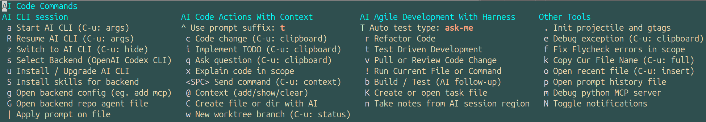

[[file:./icon.png]]

* AI Code Interface

[[https://melpa.org/#/ai-code][https://melpa.org/packages/ai-code-badge.svg]]
[[https://stable.melpa.org/#/ai-code][https://stable.melpa.org/packages/ai-code-badge.svg]]
[[https://github.com/tninja/ai-code-interface.el/graphs/contributors][https://img.shields.io/github/contributors/tninja/ai-code-interface.el.svg]]

An Emacs interface for AI-assisted software development. *The purpose is to provide a uniform interface and experience for different AI backends*, with context-aware AI coding actions, and integrating seamlessly with AI-driven agile development workflows.

- Currently it supports these AI coding CLIs:
  - [[https://github.com/anthropics/claude-code][Claude Code]]
  - [[https://github.com/google-gemini/gemini-cli][Gemini CLI]]
  - [[https://github.com/openai/codex][OpenAI Codex]]
  - [[https://docs.github.com/en/copilot/how-tos/use-copilot-agents/use-copilot-cli][GitHub Copilot CLI]]
  - [[https://opencode.ai/][Opencode]]
  - [[https://grokcli.io/][Grok CLI]]
  - [[https://docs.cursor.com/en/cli][Cursor CLI]]
  - [[https://kiro.dev/cli/][Kiro CLI]]
  - [[https://cnb.cool/codebuddy/codebuddy-code][CodeBuddy Code CLI]]
  - [[https://aider.chat/][Aider CLI]]
- It also supports external backend packages:
  - [[https://eca.dev/][ECA (Editor Code Assistant)]] (`[[./ai-code-eca.el][ai-code-eca.el]]`)
  - [[https://github.com/xenodium/agent-shell][agent-shell]] ([[https://github.com/xenodium/acp.el][acp.el]])
  - [[https://github.com/manzaltu/claude-code-ide.el][claude-code-ide.el]]
  - [[https://github.com/stevemolitor/claude-code.el][claude-code.el]]

- I switch between different CLI-based AI tools in Emacs: Claude Code / OpenAI Codex / Gemini CLI / etc. If you also use different AI tools inside Emacs, but want to keep the same user interface and experience, this package is for you.

- Lots of features and tools are ported from [[https://github.com/tninja/aider.el][aider.el]]. If you like the features in aider.el, but wish to switch to modern AI coding CLI, this package is also for you.

- Screenshot

** New User Quick Start

If you are new to this package, follow this order:
1. Read this section
2. Run the setup in *Installation*
3. Try one workflow in *Typical Workflows Example*
4. Configure backend details in *AI coding CLI backend*

Minimal setup:

#+begin_src emacs-lisp
(use-package ai-code
  :config
  (ai-code-set-backend 'codex)
  (global-set-key (kbd "C-c a") #'ai-code-menu))
#+end_src

First 60 seconds:
- `C-c a a`: Start AI CLI session
- `C-c a c`: Ask AI to change current function/region
- `C-c a q`: Ask question only (no code change)
- `C-c a z`: Jump back to AI session buffer

** Installation

Enable installation of packages from MELPA by adding an entry to package-archives after (require 'package) and before the call to package-initialize in your init.el or .emacs file:

#+begin_src emacs-lisp
(require 'package)
(add-to-list 'package-archives '("melpa" . "https://melpa.org/packages/") t)
(package-initialize)
#+end_src

- Use =M-x package-refresh-contents= or =M-x package-list-packages= to ensure that Emacs has fetched the MELPA package list
- Use =M-x package-install= to install =ai-code= package
- Import and configure =ai-code= in your init.el or .emacs file:

#+begin_src emacs-lisp
  (use-package ai-code
    ;; :straight (:host github :repo "tninja/ai-code-interface.el") ;; if you want to use straight to install, no need to have MELPA setting above
    :config
    ;; use codex as backend, other options are 'claude-code, 'gemini, 'github-copilot-cli, 'opencode, 'grok, 'cursor, 'kiro, 'codebuddy, 'aider, 'eca, 'agent-shell, 'claude-code-ide, 'claude-code-el
    (ai-code-set-backend 'codex)
    ;; Enable global keybinding for the main menu
    (global-set-key (kbd "C-c a") #'ai-code-menu)
    ;; Optional: Use eat if you prefer, by default it is vterm
    ;; (setq ai-code-backends-infra-terminal-backend 'eat) ;; config for native CLI backends. for external backends such as agent-shell, claude-code-ide.el and claude-code.el, please check their own config
    ;; Optional: Enable @ file completion in comments and AI sessions
    (ai-code-prompt-filepath-completion-mode 1)
    ;; Optional: Ask AI to run test after code changes, for a tighter build-test loop
    (setq ai-code-auto-test-type 'ask-me)
    ;; Optional: In AI session buffers, SPC in Evil normal state triggers the prompt-enter UI
    (with-eval-after-load 'evil (ai-code-backends-infra-evil-setup))
    ;; Optional: Turn on auto-revert buffer, so that the AI code change automatically appears in the buffer
    (global-auto-revert-mode 1)
    (setq auto-revert-interval 1) ;; set to 1 second for faster update
    ;; Optional: Set up Magit integration for AI commands in Magit popups
    (with-eval-after-load 'magit
      (ai-code-magit-setup-transients)))
#+end_src

** Dependencies

*** Required Dependencies
- Emacs 28.1 or later
- `org`: Org-mode support
- `magit`: Git integration
- `transient`: For the menu system
- vterm (default) or eat needs to be installed to support native AI coding CLI backends.

*** Optional Dependencies
- `helm`: For an enhanced auto-completion experience (`ai-code-input.el`).
- `gptel`: For intelligent, AI-generated content headlines in the prompt file.
  - ai-code-task-use-gptel-filename: When non-nil, file name created by `ai-code-create-or-open-task-file` or `ai-code-create-file-or-dir` will have auto-generated filenames created by GPTel
  - ai-code-notes-use-gptel-headline: When non-nil, notes created by `ai-code-take-notes` will have auto-generated headlines created by GPTel
  - ai-code-use-gptel-headline: When non-nil, prompts sent to the AI will have auto-generated headlines created by GPTel, providing better organization and readability in the prompt file
  - ai-code-use-gptel-classify-prompt: When no nil, and `ai-code-auto-test-type` is not nil, classify whether the current prompt is about code changes and need to trigger following test
- `flycheck`: To enable the `ai-code-flycheck-fix-errors-in-scope` command.
- `yasnippet`: For snippet support in the prompt file. A library of snippets is included.
  - (emacs built-in) abbrev + skeleton is also a good way to expand prompt. [[./etc/prompt_expand_with_abbrev_skeleton.el][example abbrev to solve / iterate leetcode problem with tdd (need to set ai-code-auto-test-type with tdd)]], [[./examples/leetcode][example problem resolved]]
- `projectile`: For project root initialization.
- `helm-gtags`: For tags creation.
- `python-pytest`: For running python tests in the TDD workflow.
- `jest`: For running JavaScript / TypeScript tests in the TDD workflow.

** Key Features

- *Transient-Driven Hub (`C-c a`)*: One keystroke opens a contextual transient menu that groups every capability (CLI control, code actions, agile workflows, utilities) so you never need to memorize scattered keybindings.
- *AI CLI Session Management*: Start (`a`), resume (`R`), or jump back into (`z`) the active AI CLI buffer, instantly swap backends (`s`), upgrade them (`u`), install backend skills (`S`), edit backend configs (`g`), open backend agent file (`G`), and run prompts against the current file (`|`). It support multiple sessions per project.
- *Context-Aware Code Actions*: The menu exposes dedicated entries for changing code (`c`), implementing TODOs (`i`), asking questions (`q`), explaining code (`x`), sending free-form commands (`<SPC>`), and refreshing AI context (`@`). Each command automatically captures the surrounding function, region, or clipboard contents (via `C-u`) to keep prompts precise.
- *Agile Development Workflows*: Use the refactoring navigator (`r`), the guided TDD cycle (`t`), and the pull/review diff helper (`v`) to keep AI-assisted work aligned with agile best practices. Prompt authoring is first-class through quick access to the prompt file (`p`), build/test helper (`b`), and AI-assisted shell/file execution (`!`). In prompt files, send the current block with `C-c C-c`.
- *Productivity & Debugging Utilities*: Initialize project navigation assets (`.`), investigate exceptions (`e`), auto-fix Flycheck issues in scope (`f`), copy or open file paths formatted for prompts (`k`, `o`), generate MCP inspector commands (`m`), capture session notes straight into Org (`n`), and toggle desktop notifications (`N`) to get alerted when AI responses are ready in background sessions.
- *Seamless Prompt Management*: Open the prompt file via `ai-code-open-prompt-file` (stored under `.ai.code.files/.ai.code.prompt.org` by default), send regions with `ai-code-prompt-send-block`, and reuse prompt snippets via `yasnippet` to keep conversations organized.
- *Interactive Chat & Context Tools*: Dedicated buffers hold long-running chats, automatically enriched with file paths, diffs, and history from Magit or Git commands for richer AI responses.
- *AI-Assisted Bash Commands*: From Dired, shell, eshell, or vterm, run `C-c a !` and type natural-language commands prefixed with `:` (e.g., `:count lines of python code recursively`); the tool generates the shell command for review and executes it in a compile buffer.

*** Typical Workflows Example

- *Changing Code*: Position the cursor on a function or select a region of code. Press `C-c a`, then `c` (`ai-code-code-change`). Describe the change you want to make in the prompt. The AI will receive the context of the function or region and your instruction. 
- *Implementing a TODO*: Write a comment in your code, like `;; TODO: Implement caching for this function`. Place your cursor on that line and press `C-c a`, then `i` (`ai-code-implement-todo`). The AI will generate the implementation based on the comment.
  - Relevant packages for TODO: [[https://github.com/tarsius/hl-todo][hl-todo]], [[https://github.com/alphapapa/magit-todos][magit-todos]]
- *Asking a Question*: Place your cursor within a function, press `C-c a`, then `q` (`ai-code-ask-question`), type your question, and press Enter. The question, along with context, will be sent to the AI.
- *Refactoring a Function*: With the cursor in a function, press `C-c a`, then `r` (`ai-code-refactor-book-method`). Select a refactoring technique from the list, provide any required input (e.g., a new method name), and the prompt will be generated.
- *Automatically run tests after change*: When ai-code-auto-test-type is non-nil, AI will automatically run tests after code changes and follow up on results.
- *One-prompt TDD with refactoring*: Press `C-c a`, then `t` (`ai-code-tdd-cycle`) and choose `5. Red + Green + Blue (One prompt)` to generate tests, implement code, run tests, and then refactor the changed code in one flow.
- *Reviewing a Pull Request*: Press `C-c a`, then `v` (`ai-code-pull-or-review-diff-file`). Choose to generate a diff between two branches. The diff will be created in a new buffer, and you'll be prompted to start a review.
- *Multiple Sessions Support*: Start more AI coding session with C-c a a after launching one. Select active session with C-c a z. Prompt with above command will be sent to the selected session.

*** Context Engineering

Context engineering is the deliberate practice of selecting, structuring, and delivering the right information to an AI model so the output is specific, accurate, and actionable. For AI-assisted programming, the model cannot read your whole codebase by default, so the quality of the result depends heavily on the clarity and relevance of the provided context (file paths, functions, regions, related files, and repo-level notes). Good context engineering reduces ambiguity, prevents irrelevant suggestions, and keeps changes aligned with the current code.

This package makes context engineering easy by automatically assembling precise context blocks and letting you curate additional context on demand:
- Automatic file and window context: prompts can include the current file and other visible files (`ai-code--get-context-files-string`), so the AI sees related code without manual copying.
- Function or region scoping: most actions capture the current function or active region, keeping requests focused (e.g., `ai-code-code-change`, `ai-code-implement-todo`, `ai-code-ask-question`).
- Manual context curation: `C-c a @` (`ai-code-context-action`) stores file paths, function anchors, or region ranges in a repo-scoped list, which is appended to prompts via `ai-code--format-repo-context-info`.
- Optional clipboard context: prefix with `C-u` to append clipboard content to prompts for external snippets or logs.
- @-triggered filepath completion in comments and AI sessions. Type `@` to open a completion list of recent and visible repo files, then select a path to insert.
- Prompt suffix guardrails: set `ai-code-prompt-suffix` to append persistent constraints to every prompt (when `ai-code-use-prompt-suffix` is non-nil). Example: `(setq ai-code-prompt-suffix "Only use English in code file, but Reply in Simplified Chinese language")`.
- Optional GPTel headline generation: set `ai-code-use-gptel-headline` to auto-generate prompt headings with GPTel.

Example (focused refactor with curated context):
1) In a buffer, run `C-c a @` to add the current function or selected region to stored repo context.
2) Open another related file in a window so it is picked up by `ai-code--get-context-files-string`.
3) Place the cursor in the target function and run `C-c a c` to request a change.
The generated prompt will include the function/region scope, visible file list, and stored repo context entries, giving the AI exactly the surrounding information it needs.

- MCP can provide critical context to AI model. You can use C-c a g to open and add mcp config for corresponding AI coding CLI. Examples MCPs:
  - [[https://github.com/github/github-mcp-server][Github MCP]]
  - [[https://github.com/sooperset/mcp-atlassian][Atlassian MCP]]
  - [[https://github.com/crystaldba/postgres-mcp][Postgresql MCP]] / Sqlite MCP
  - [[https://github.com/docker/mcp-gateway][Docker]] / [[https://github.com/containers/kubernetes-mcp-server][Kubernetes]] MCP

- [[https://martinfowler.com/articles/exploring-gen-ai/context-engineering-coding-agents.html][Context Engineering for Coding Agents]], recommended by Martin Fowler.

*** Harness Engineering Practice

**** Build / Test Feedback Loop

Use the prompt suffix and TDD helpers to keep a tight build + test loop. This reduces context switching, shortens the time between a change and verified feedback, and lets the AI work more independently with less human-in-the-loop effort:

- `ai-code-auto-test-type`: Selects how prompts request tests after code changes (test-after-change, TDD Red+Green, TDD Red+Green+Blue, off, or ask me).
- `ai-code--tdd-red-green-stage`: Generates a single prompt for Red + Green with explicit test follow-up.
- `ai-code--tdd-red-green-blue-stage`: Generates a single prompt for Red + Green + Blue (refactoring) with explicit test follow-up.
- `ai-code-build-or-test-project`: Run the project build or test from the menu (`C-c a b`).

- Relevant article: [[https://martinfowler.com/articles/exploring-gen-ai/harness-engineering.html][Harness Engineering]]

*** Desktop Notifications (Experimental)

When working with multiple AI sessions, it can be useful to receive desktop notifications when AI responses are complete. This is especially helpful when you prompt an AI and then switch to other tasks while waiting for the response.

**** Enabling Notifications
- Notifications are disabled by default.
- Press `C-c a` then `N` to toggle notifications on/off.
- Alternatively, use `M-x ai-code-notifications-toggle`.
- To enable notifications in your config:
#+begin_src emacs-lisp
(setq ai-code-notifications-enabled t)
(setq ai-code-notifications-show-on-response t)
#+end_src

**** How It Works
- The package monitors terminal activity in AI session buffers.
- When the terminal has been idle for ~5 seconds (configurable via `ai-code-backends-infra-idle-delay`), it's considered a completed response.
- If the AI session buffer is not currently visible/focused, a desktop notification is sent.
- Notifications are throttled to avoid spam (minimum 2 seconds between notifications).

**** Platform Support
- On Linux with D-Bus, native desktop notifications are used.
- On other platforms, notifications appear in the Emacs minibuffer.

** AI coding CLI backend

*** Backend Configuration
    This package acts as a generic interface that requires a backend AI assistant package to function. You can configure it to work with different backends.

   - Press `C-c a` to open the AI menu, then `s` to "Select Backend".
   - Pick one of the supported backends and the integration will switch immediately.
   - The selection updates the start/switch/send commands and, for CLI backends, the CLI used by `ai-code-apply-prompt-on-current-file`.
   - Press `C-c a` then `S` (`ai-code-install-backend-skills`) to install backend skills for the currently selected backend.
     - If a backend does not define its own installer, `S` falls back to prompting the active AI CLI to read a skills repository README and perform setup.

   Natively supported options:
   - [[https://github.com/anthropics/claude-code][Claude Code]] (`[[./ai-code-claude-code.el][ai-code-claude-code.el]]`)
   - [[https://github.com/google-gemini/gemini-cli][Gemini CLI]] (`[[./ai-code-gemini-cli.el][ai-code-gemini-cli.el]]`)
   - [[https://github.com/openai/codex][OpenAI codex CLI]] (`[[./ai-code-codex-cli.el][ai-code-codex-cli.el]]`)
   - [[https://docs.github.com/en/copilot/how-tos/use-copilot-agents/use-copilot-cli][GitHub Copilot CLI]] (`[[./ai-code-github-copilot-cli.el][ai-code-github-copilot-cli.el]]`)
   - [[https://opencode.ai/][Opencode]] (`[[./ai-code-opencode.el][ai-code-opencode.el]]`)
   - [[https://grokcli.io/][Grok CLI]] (`[[./ai-code-grok-cli.el][ai-code-grok-cli.el]]`)
   - [[https://docs.cursor.com/en/cli][Cursor CLI]] (`[[./ai-code-cursor-cli.el][ai-code-cursor-cli.el]]`)
   - [[https://kiro.dev/cli/][Kiro CLI]] (`[[./ai-code-kiro-cli.el][ai-code-kiro-cli.el]]`)
   - [[https://cnb.cool/codebuddy/codebuddy-code][CodeBuddy Code CLI]] (`[[./ai-code-codebuddy-cli.el][ai-code-codebuddy-cli.el]]`)
   - [[https://aider.chat/][Aider CLI]] (`[[./ai-code-aider-cli.el][ai-code-aider-cli.el]]`)
   
   It also supports external backends through customization of the `ai-code-backends` variable; currently it includes:
   - [[https://eca.dev/][ECA (Editor Code Assistant)]] (`[[./ai-code-eca.el][ai-code-eca.el]]`)
   - [[https://github.com/xenodium/agent-shell][agent-shell]] (`[[./ai-code-agent-shell.el][ai-code-agent-shell.el]]`)
   - Claude Code IDE (`[[https://github.com/manzaltu/claude-code-ide.el][claude-code-ide.el]]`)
   - Claude Code (`[[https://github.com/stevemolitor/claude-code.el][claude-code.el]]`)

**** ECA (Editor Code Assistant) backend setup
     Install the [[https://eca.dev/][eca]] Emacs package, which provides the =eca=, =eca-session=, =eca-chat-open=,
     =eca-chat-send-prompt=, and =eca-chat--get-last-buffer= functions.
     Then select the backend in your config:
     #+begin_src emacs-lisp
     (ai-code-set-backend 'eca)
     #+end_src
     Note: =ai-code-apply-prompt-on-current-file= is CLI-pipe based and does not have special integration with =eca=; its behavior depends on the configured AI coding CLI.

**** agent-shell backend setup
     Install [[https://github.com/xenodium/agent-shell][agent-shell]] and its dependency [[https://github.com/xenodium/acp.el][acp.el]], then configure one of the ACP agent providers in agent-shell (for example Codex, Gemini, Opencode, etc.).
     Select `agent-shell` via `ai-code-select-backend` (or `(ai-code-set-backend 'agent-shell)` in your config).
     Note: `ai-code-apply-prompt-on-current-file` is CLI-pipe based and is not supported when `agent-shell` is the active backend.

**** Grok CLI setup
     Install [[https://grokcli.io/][grok-cli]] and ensure the `grok` executable is on your PATH.
     Customize `ai-code-grok-cli-program` or `ai-code-grok-cli-program-switches` if you want to
     point at a different binary or pass additional flags (for example,
     selecting a profile). After that, select the backend through
     `ai-code-select-backend` or bind a helper in your config.

**** CodeBuddy Code CLI setup
     Install CodeBuddy Code CLI via npm: =npm install -g @tencent-ai/codebuddy-code=, or via Homebrew: =brew install Tencent-CodeBuddy/tap/codebuddy-code=.
     Ensure the `codebuddy` executable is on your PATH.
     Customize `ai-code-codebuddy-cli-program` or `ai-code-codebuddy-cli-program-switches` if you want to
     point at a different binary or pass additional flags. After that, select the backend through
     `ai-code-select-backend` or bind a helper in your config.
     To resume previous conversations, use =-c= flag (automatically handled by the resume command).

   You can add other backends by customizing the `ai-code-backends` variable.

**** Add a new AI coding CLI backend

- [[https://github.com/tninja/ai-code-interface.el/pull/2][This PR]] adds github-copilot-cli. It can be an example to add basic support for other AI coding CLI.

- Open an issue, post information about the new AI coding CLI backend (eg. cursor CLI?), at least providing the command line name. You can also include the version upgrade command, how to resume, where the configuration files are located, and so on. We can ask GitHub Copilot to add support features based on the issue.

** [[https://github.com/tninja/aider.el/blob/main/appendix.org#be-careful-about-ai-generated-code][Why Agile development with AI?]]

** FAQ

*** Q: Using Opencode as backend, it might have performance issues with eat.el in Doom Emacs. [[https://github.com/tninja/ai-code-interface.el/issues/9#issuecomment-3543277108][Issue]]

- A: Use vterm as the backend; Opencode won't trigger mouse hover and will not cause Emacs flickering. Setting "theme" to "system" in the Opencode config can reduce glitches. From [[https://github.com/tninja/ai-code-interface.el/issues/9#issuecomment-3543335121][gkzhb's answer]]:
#+begin_src json
{
  "$schema": "https://opencode.ai/config.json",
  "theme": "system"
}
#+end_src

*** Q: Gemini CLI response is relatively slow, how to improve?

- A: use gemini-3-flash model, it is pretty fast, with good quality (being able to solve leetcode hard problems), and it is free. You can set the following in your Emacs config:

#+begin_src elisp
  (setq ai-code-gemini-cli-program-switches '("--model" "gemini-3-flash-preview"))
#+end_src

*** Q: Codex CLI use my API key, instead of my ChatGPT Plus subscription and cost money, how to fix that?

- A: use `codex login` to login with your OpenAI account that has ChatGPT Plus subscription. After that, Codex CLI will use your ChatGPT Plus subscription automatically. To confirm, check with /status inside the codex CLI buffer.

*** Q: When test-after-change / TDD mode is enabled, AI keeps asking for tool-use approval. How can I make this smoother?

- A: Enable auto-approval for your active AI coding CLI. For example, in Codex CLI, you can enable the following flag.
#+begin_src elisp
  (setq ai-code-codex-cli-program-switches '("--full-auto"))
#+end_src

** AI Assisted Programming related books

The following books introduce how to use AI to assist programming and potentially be helpful to aider / aider.el users.

- [[https://learning.oreilly.com/library/view/beyond-vibe-coding/9798341634749/][Beyond Vibe Coding]], by Addy Osmani, August, 2025
- [[https://learning.oreilly.com/library/view/critical-thinking-habits/0642572243326/][Critical Thinking Habits for Coding with AI]], by Andrew Stellman, Oct 2025
- [[https://www.amazon.com/Software-Testing-Generative-Mark-Winteringham/dp/1633437361/ref=sr_1_34?crid=2MDJBJSIIFHHB&dib=eyJ2IjoiMSJ9.r49jgbX_SxOsAZOy3KnPP9rvtd9VmO1Jjn2Gcon-UgRSwLnzEtcArbaYhW-0h3PyxiJt_4RpfEqhGuiHyh8H-r11rZXxGPxnlIZh0eEaxrvpfKmKJO-mVPk2NRiNp_HRvy8BQqRSeqxMAmuCtGEfu-XofuacCNaxrTDIgNNL23MCTymRqIYQKCJlgW6MUvE00RLnIUYy3j-MSUILOhRpj3HLIJnN0jTyWI8MXfJ3oZGvw4orwskyYZR7kb1_fDX7LLF622PXZmiWn-wFEergew7_6G5D31icv4uNlcIC1Ts.Vf51k-Ag1zVOkmkjkDiVWjpoky698yTcppUBllLxjs4&dib_tag=se&keywords=AI+programming&qid=1748737750&sprefix=ai+programming%2Caps%2C352&sr=8-34][Software Testing with Generative AI]], by Mark Winteringham, Dec 2024

- [[https://github.com/tninja/aider.el?tab=readme-ov-file#ai-assisted-programming-related-books][More AI Assisted Programming related books]]

** Related Emacs packages
- Claude Code (`[[https://github.com/stevemolitor/claude-code.el][claude-code.el]]`)
- Claude Code IDE (`[[https://github.com/manzaltu/claude-code-ide.el][claude-code-ide.el]]`)
- Gemini CLI (`[[https://github.com/linchen2chris/gemini-cli.el][gemini-cli.el]]`)
- [[https://github.com/xenodium/agent-shell][agent-shell]] ([[https://github.com/xenodium/acp.el][acp.el]])
- [[https://eca.dev/][ECA (Editor Code Assistant)]]

** License

Apache-2.0 License

** Contributing

Contributions, issue reports, and improvement suggestions are welcome! Please open an issue or submit a pull request on the project's GitHub repository.
